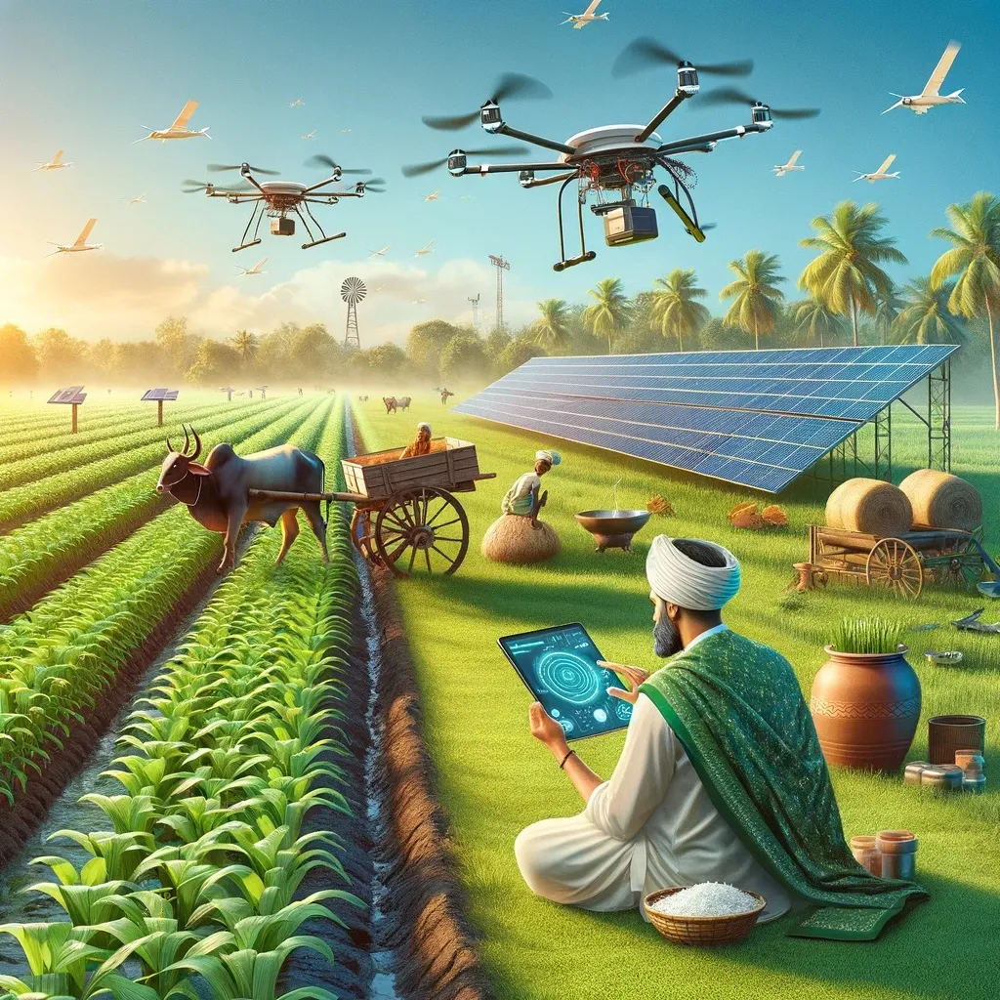

  

🧑‍🌾 Farmers App
  A full-stack web application that connects farmers directly with customers.
  This platform enables farmers to sell fresh produce online and helps buyers browse, order, and communicate effortlessly — all through a modern, responsive interface.

🚀 Overview

  👨‍🌾 Farmer Panel: Add, edit, and manage products
  
  🛒 Buyer Panel: Browse and place orders
  
  🔐 Authentication: Secure JWT-based login and registration
  
  🧑‍💼 Admin Panel: Manage users, verify farmers, and oversee platform activity
  
  💬 Notifications: Real-time (polling-based) updates
  
  💾 Database: MySQL integration for structured and scalable data
  
  🎨 Frontend: Built using React + Tailwind CSS + Vite

🛠️ Tech Stack
   Layer	                         Technology
   
   Frontend	                       React 18, Vite, Tailwind CSS, React Router, Axios, Lucide React
   Backend	                       Node.js, Express.js
   Database	                       MySQL
   Authentication	                 JWT (JSON Web Tokens)
   Notifications	                 Polling-based notification system
   Other Tools	                   Postman, Git, ESLint

📁 Project Structure

  farmers-App/
  ├── client/                 # Frontend (React + Vite)
  │   ├── src/
  │   │   ├── components/     # Reusable UI components
  │   │   ├── contexts/       # React Contexts (Auth, Notifications)
  │   │   ├── hooks/          # Custom hooks
  │   │   ├── pages/          # All page-level components
  │   │   ├── utils/          # Utility functions
  │   │   ├── App.jsx         # Root component
  │   │   ├── main.jsx        # Entry point
  │   │   └── style.css       # Global styles
  │   ├── .env.example
  │   ├── package.json
  │   └── tailwind.config.js
  │
  └── server/                 # Backend (Node + Express)
      ├── config/             # DB & environment config
      ├── controllers/        # Business logic
      ├── models/             # MySQL models
      ├── routes/             # API routes
      ├── middleware/         # Auth middleware
      ├── server.js           # App entry point
      ├── .env.example
      └── package.json

⚙️ Setup Instructions

  🧩 Prerequisites
    Node.js (v16+)
    MySQL Server installed and running
    npm or yarn

  🖥️ Backend Setup
      1. Navigate to server folder
          cd server  
      2. Install dependencies
          npm install
      3. Configure environment
          cp .env.example .env
            Example .env file:
              DB_HOST=localhost
              DB_USER=root
              DB_PASS=your_password
              DB_NAME=farmer_marketplace
              JWT_SECRET=your_secret_key
              PORT=5000
      4.Start the backend
        npm start
      
  🌐 Frontend Setup
       1. Navigate to client folder
          cd client  
      2. Install dependencies
          npm install
      3. Add environment variables
          cp .env.example .env
      4.Run the frontend
        npm run dev
👤 User Roles & Features
  🛒 Buyer
    - Browse and search for products
    - View product details
    - Place and track orders
    - Receive notifications
  
  👨‍🌾 Farmer
    - Add, edit, and delete products
    - Upload product images
    - Manage orders (confirm/deliver)
    - View sales and order history
    
  🧑‍💼 Admin
    - Manage users and farmers
    - Verify farmer accounts
    - Access marketplace insights

🔐 Authentication
  -> JWT-based authentication system
  -> Role-based route protection (Farmer / Buyer / Admin)
  -> Secure token storage in localStorage
  -> Auto token expiry handling

🧪 Testing Guide

  -> Register a Farmer account → Add products  
  -> Register a Buyer account → Place orders
  -> Login as Admin → Verify farmers & view users
  -> Test order lifecycle: Pending → Confirmed → Delivered
  -> Observe real-time notifications and UI updates

🧰 Troubleshooting
  Issue	Possible Fix
    -> API not connecting	Check if backend is running on port 5000
    -> JWT invalid	Clear localStorage and login again
    -> Image upload fails	Check file type/size (max 5MB)
    -> Build errors	Delete node_modules and reinstall dependencies

🌟 Author
  Vishal Verma
  💻 Full Stack Developer | MERN | MySQL

